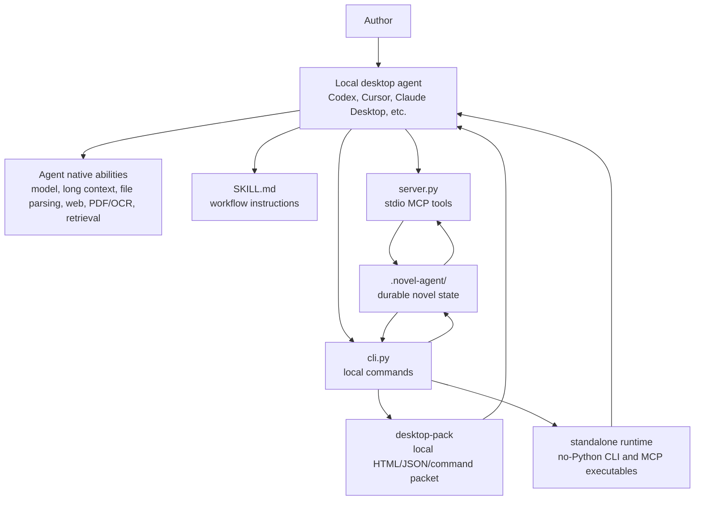
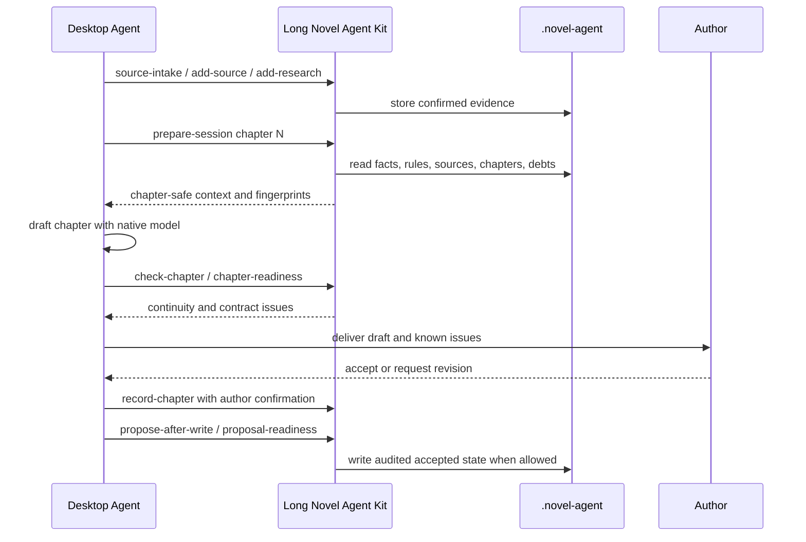

# Long Novel Agent Kit

Local continuity infrastructure for writing long novels with desktop agents.

Long Novel Agent Kit does not replace the model, the writing agent, or the author's judgment. It gives local desktop agents a durable project memory and a set of safety gates so a long novel can survive long context windows, agent handoffs, source material updates, and multi-chapter continuity drift.

[中文说明](README.zh-CN.md) · [中文整体架构与功能说明](docs/system-overview.zh-CN.md)

## The Short Version

Use the desktop agent for intelligence. Use this kit for continuity.

- The desktop agent reads PDFs, old drafts, notes, web pages, images, and long files with its native tools.
- The agent writes confirmed summaries, facts, research notes, and decisions into `.novel-agent/`.
- Before drafting, the agent calls `prepare-session` or `build-context` instead of relying on chat history.
- Before delivery, the agent calls continuity checks and delivery helpers.
- After the author accepts a chapter, writer tools record the chapter and update durable state with author confirmation.
- Another local agent can later read the same `.novel-agent/` state and continue the book.

## Architecture At A Glance



### Component Responsibilities

| Component | What it does | What it does not do |
| --- | --- | --- |
| Desktop agent | Reads sources, reasons about prose, drafts and revises chapters, uses its own search/parsing/model tools | It is not trusted as durable memory by itself |
| `SKILL.md` | Tells an agent the required writing protocol and when to call the tools | It does not store state or execute commands |
| `server.py` | Exposes the kit through local stdio MCP, with read-only and writer modes | It is not a remote server and does not require cloud hosting |
| `cli.py` | Provides local commands for setup, context, checks, packs, handoff, and writer operations | It does not call an LLM |
| `.novel-agent/` | Stores accepted continuity, sources, facts, chapters, proposals, audit rows, and snapshots | It is not a manuscript editor |
| `desktop-pack` | Creates a local packet with HTML pages, JSON state, schemas, commands, evidence templates, and handoff files | It does not prove the GUI desktop client has loaded MCP |
| `standalone-build` / `desktop-handoff-bundle` | Builds and packages no-Python local runtimes for another computer | It cannot cross-build every operating system reliably |

## Core State Model

Every novel project keeps long-term continuity in `.novel-agent/`.

| File | Purpose |
| --- | --- |
| `manifest.json` | Project identity, schema version, current chapter metadata |
| `rules.json` | Required phrases, forbidden phrases, future markers, naming constraints |
| `chapters.jsonl` | Accepted chapter records, summaries, tails, handoff notes |
| `facts.jsonl` | Structured facts for continuity checks, such as ownership, location, status, relationships, timeline |
| `sources.jsonl` | Source summaries confirmed from old drafts, PDFs, notes, or other local materials |
| `research.jsonl` | Research notes and reliability notes from external lookup |
| `conflicts.jsonl` | Resolved contradictions and the chosen version |
| `characters.json` | Character state, arcs, relationships, and constraints |
| `debts.json` | Foreshadowing, promises, unresolved plot debt |
| `contracts.jsonl` | Chapter goals, required beats, forbidden moves, acceptance checks |
| `proposals.jsonl` | Proposed post-write updates awaiting review or application |
| `agent_activity.jsonl` | Local agent activity and handoff logs |
| `desktop_verifications.jsonl` | Real desktop client evidence records |
| `audit.jsonl` | Durable write audit trail |
| `snapshots/` | Rollback snapshots created before risky state changes |

## Capability Map

| Problem | Main commands / tools | Result |
| --- | --- | --- |
| Start a new novel state | `init`, `quickstart` | Creates `.novel-agent/` and baseline files |
| Import an existing Gaoxia-style project | `import-gaoxia`, `quickstart --source auto`, `import-audit` | Converts chapters, Vault notes, memory, and narrative state into local continuity state |
| Save source summaries from the host agent | `source-intake`, `add-source`, `add-research`, `resolve-conflict`, `add-fact` | Turns parsed material into durable evidence and rules |
| Prepare a chapter | `prepare-session`, `build-context`, `context-brief` | Returns chapter-safe context, visible facts, rules, handoff, budget, and fingerprints |
| Check a draft | `check-chapter`, `chapter-readiness`, `diff-contract` | Finds rule violations, missing beats, fact conflicts, future leaks, and state conflicts |
| Help revision | `chapter-revision-prompt`, `chapter-revision-compare` | Produces targeted repair instructions and before/after issue comparison |
| Deliver to author | `chapter-delivery`, `chapter-range-delivery` | Bundles readiness, known issues, handoff state, and post-acceptance commands |
| Update long-term state after acceptance | `record-chapter`, `proposal-template`, `propose-after-write`, `proposal-readiness`, `apply-after-write` | Records accepted chapter and applies reviewed continuity updates |
| Prevent stale or wrong-project writes | `write-session-check`, expected project/state/context hashes | Blocks writer commands when the state has changed since context generation |
| Hand off to another local agent | `handoff-report`, `handoff-readiness`, `handoff-integrity`, `agent-activity-report` | Gives the next agent enough durable context to continue safely |
| Give a normal user a local packet | `desktop-pack`, `pack-doctor`, `pack-schema-check`, `desktop-pack-readiness` | Creates and validates a browser-readable and agent-readable local packet |
| Prove a real desktop client can use the kit | `desktop-checklist`, `ingest-desktop-evidence`, `desktop-results-doctor`, `record-desktop-check`, `desktop-matrix` | Separates local config checks from real GUI client evidence |
| Move to another computer without Python | `standalone-build`, `desktop-handoff-bundle` | Creates runtime executables plus a copyable project/pack/runtime bundle |
| Recover or audit state | `snapshot`, `restore-snapshot`, `export-state`, `import-state`, `doctor`, `continuity-audit` | Supports rollback, migration, and project health checks |

## The Main Writing Flow



The important rule: generate context from durable state before writing. Do not treat chat history as the source of truth.

## Read-Only Mode And Writer Mode

Read-only MCP is the default and recommended mode:

```bash
python server.py --read-only --tool-profile core
```

Read-only mode can prepare context, check drafts, build reports, inspect packs, and explain next steps. It cannot change `.novel-agent/`.

Writer mode can change durable state, so it is gated:

- The author must confirm the write.
- `write-session-check` compares project identity, state fingerprint, and chapter context fingerprint.
- Proposal readiness checks evidence, conflicts, and risk.
- `.write.lock` prevents concurrent writes.
- Snapshots are created before applied proposal updates.
- Every durable write appends to `audit.jsonl`.

## Desktop Packs

`desktop-pack` is the bridge between the kit and ordinary local desktop-agent usage.

It writes a local directory containing:

- `first-three.html`, `local-summary.html`, and `user-steps.html` for a normal user
- `pack-index.json`, `commands.json`, `commands-index.json`, and schemas for an agent
- `chapter-session.json`, `handoff-report.json`, project status, continuity audit, and author review queue
- setup, install, upgrade, uninstall, local check, and archive scripts for macOS, Windows, and POSIX shells
- evidence templates and result JSON schemas for proving real GUI client behavior
- acceptance review and writer-mode authorization packets

The pack is a local guide and snapshot. If it is copied or moved, run `pack-doctor`, `pack-freshness`, or `rebind-pack-kit` before trusting old paths.

## No-Python Handoff

For non-technical users on another computer, build a same-OS standalone runtime first:

```bash
python cli.py standalone-build \
  --output-dir release/long-novel-agent-runtime-macos-arm64 \
  --target-os macos \
  --apply \
  --force \
  --format json
```

Then create a handoff bundle:

```bash
release/long-novel-agent-runtime-macos-arm64/long-novel-agent desktop-handoff-bundle ./my-novel \
  --platform codex \
  --mode read-only \
  --chapter 1 \
  --runtime-dir release/long-novel-agent-runtime-macos-arm64 \
  --output-dir release/my-novel-agent-bundle \
  --archive \
  --force \
  --format json
```

The bundle contains `project/`, `pack/`, `runtime/`, launchers, MCP snippets, runtime command files, and `agent-read-me-first.md`. When both runtime executables are present, the target computer does not need Python.

For a Windows `.exe` release, build on Windows and follow [Windows Runtime Release](docs/windows-release.md). The GitHub Actions template is stored at [docs/github-actions-windows-release.yml](docs/github-actions-windows-release.yml); copy it into `.github/workflows/` only when the GitHub token used for the push has `workflow` scope.

## Quick Start From Source

```bash
git clone https://github.com/mushroomfk/long-novel-agent-kit.git
cd long-novel-agent-kit
python cli.py doctor
python cli.py init ./my-novel --title "My Novel"
python cli.py prepare-session ./my-novel --chapter 1 --platform codex --mode read-only --format markdown
```

Check a draft:

```bash
python cli.py check-chapter ./my-novel --chapter 1 --file chapters/001.md --format markdown
```

Generate a desktop setup guide:

```bash
python cli.py desktop-setup ./my-novel --platform codex --mode read-only --format markdown
```

## What This Kit Does Not Do

- It does not run an LLM.
- It does not include embedding search.
- It does not parse PDF/OCR/web pages by itself.
- It does not upload manuscripts.
- It does not require a server for local desktop use.
- It does not replace literary judgment, editing taste, or author approval.

Those jobs belong to the host desktop agent and the author. This kit persists and verifies the continuity layer.

## Repository Layout

```text
.
├── cli.py                         # local CLI
├── server.py                      # stdio MCP server
├── install.py                     # local skill and MCP installer
├── SKILL.md                       # agent workflow instructions
├── schemas/                       # JSON schemas for proposals and desktop packs
├── assets/review-panel.html       # local static proposal review panel
├── examples/                      # smoke, handoff, evidence, and adversarial examples
├── docs/                          # architecture, install, workflow, and release docs
├── scripts/verify_agent_kit.py    # full regression check
└── scripts/adversarial_release_check.py
```

## Verification

Run the full regression suite:

```bash
python scripts/verify_agent_kit.py
```

Run the stronger release gate:

```bash
python scripts/adversarial_release_check.py
```

An optional GitHub Actions workflow template is available at `docs/github-actions-verify.yml`. Repository maintainers with `workflow` scope can copy it to `.github/workflows/verify.yml`.

## Requirements

- Python 3.10 or newer for source-based CLI/MCP usage.
- A local desktop agent that can start stdio MCP or run shell commands.
- Optional: PyInstaller when building no-Python runtime bundles.

## Supported Local Agent Paths

- CLI-only agents can run `python cli.py ...`.
- MCP-capable agents can start `python server.py --read-only`.
- Codex and Cursor local config paths can be generated automatically by `install.py`.
- Claude Desktop and generic JSON MCP clients can use explicit config snippets.

Remote connector-only platforms are outside this local stdio MCP flow.

## License

MIT. See [LICENSE](LICENSE).
