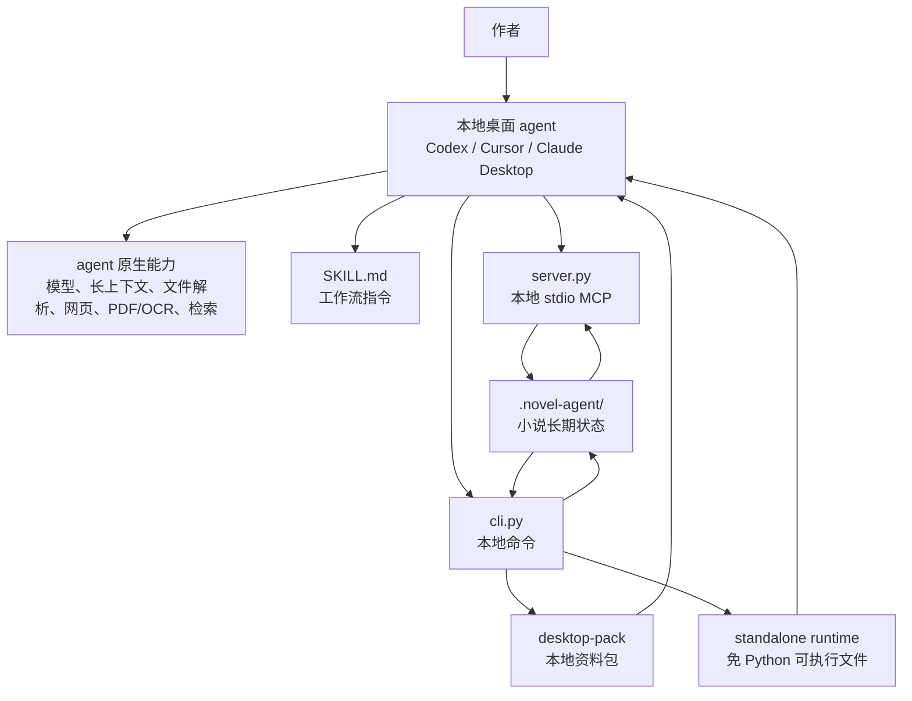
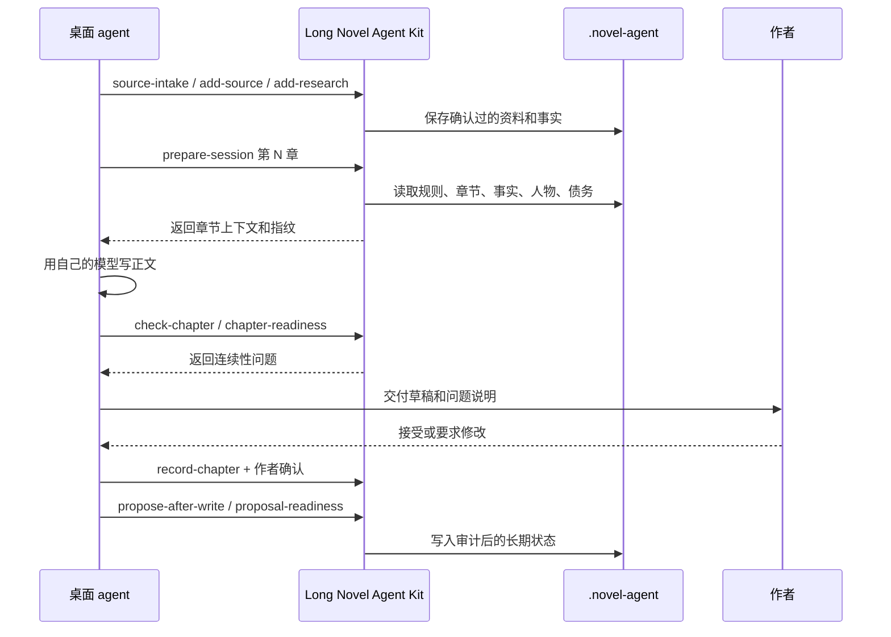

# Long Novel Agent Kit

给本地桌面智能体使用的长篇小说连续性基础设施。

它不是写作模型，也不是稿匣主应用。它负责把长篇小说的长期状态保存在本地 `.novel-agent/` 目录里，并提供 MCP、CLI 和 Skill 工作流，让 Codex、Cursor、Claude Desktop 等本地桌面 agent 可以在不同会话、不同机器、不同 agent 之间接力写同一部小说。

详细中文说明见：[整体架构与功能说明](docs/system-overview.zh-CN.md)。

## 先看这一段

桌面 agent 负责“聪明”，这个 Kit 负责“记住并检查”。

- 桌面 agent 用自己的模型、长上下文、文件读取、PDF/OCR、网页、检索能力理解资料和写正文。
- Kit 把确认过的资料摘要、考据、事实、人物状态、伏笔、剧情债务和章节交接写进 `.novel-agent/`。
- 开写前，agent 必须从 Kit 生成目标章节上下文，不能只靠聊天历史。
- 交稿前，agent 用 Kit 检查连续性、章节合同、必写项和禁写项。
- 作者接受后，writer 命令才把章节和写后更新写入长期状态。
- 换另一位 agent 时，新的 agent 读取同一个 `.novel-agent/` 和交接包继续写。

## 整体架构



## 每个组件负责什么

| 组件 | 职责 | 不负责 |
| --- | --- | --- |
| 桌面 agent | 读取资料、理解文本、写正文、改稿、用自己的模型和检索能力推理 | 不作为长期记忆的唯一来源 |
| `SKILL.md` | 告诉 agent 写长篇时必须按什么流程调用工具 | 不保存状态，不执行命令 |
| `server.py` | 提供本地 stdio MCP 工具，支持只读和 writer 模式 | 不是远程服务器，不需要云端部署 |
| `cli.py` | 提供初始化、上下文、检查、资料包、交接、写入等本地命令 | 不调用大模型 |
| `.novel-agent/` | 保存确认过的事实、资料、章节、人物、伏笔、proposal、审计和快照 | 不替代正文编辑器 |
| `desktop-pack` | 生成给普通用户和桌面 agent 使用的本地 HTML / JSON / 命令资料包 | 不能证明真实 GUI 客户端已经加载 MCP |
| `standalone-build` / `desktop-handoff-bundle` | 生成免 Python 运行时和可复制交接包 | 不保证跨系统构建可执行文件 |

## `.novel-agent/` 里有什么

| 文件 | 用途 |
| --- | --- |
| `manifest.json` | 项目身份、schema 版本、当前章节信息 |
| `rules.json` | 必写项、禁写项、未来标记、命名限制 |
| `chapters.jsonl` | 已接受章节记录、摘要、尾段、交接 |
| `facts.jsonl` | 人物状态、道具归属、地点、关系、时间线等可检查事实 |
| `sources.jsonl` | 旧稿、PDF、笔记、资料等来源摘要 |
| `research.jsonl` | 联网考据和可靠性说明 |
| `conflicts.jsonl` | 冲突事实和作者确认采用哪一版 |
| `characters.json` | 人物状态、关系、弧线和约束 |
| `debts.json` | 伏笔、承诺、未解决剧情债务 |
| `contracts.jsonl` | 章节目标、必写情节、禁写方向、验收项 |
| `proposals.jsonl` | 写后更新提案和审阅状态 |
| `agent_activity.jsonl` | agent 准备、起草、检查、交接等活动记录 |
| `desktop_verifications.jsonl` | 真实桌面客户端验证证据 |
| `audit.jsonl` | 长期状态写入审计 |
| `snapshots/` | 回滚快照 |

## 功能地图

| 你遇到的问题 | 用什么能力 | 得到什么结果 |
| --- | --- | --- |
| 新建一部小说的长期状态 | `init`、`quickstart` | 创建 `.novel-agent/` 基础档案 |
| 接入已有稿匣项目 | `import-gaoxia`、`quickstart --source auto`、`import-audit` | 把章节、Vault、项目记忆、叙事状态转成长期状态 |
| 保存桌面 agent 解析出的资料 | `source-intake`、`add-source`、`add-research`、`resolve-conflict`、`add-fact` | 把资料摘要、考据、冲突选择和事实写入档案 |
| 开写某一章 | `prepare-session`、`build-context`、`context-brief` | 返回本章可见上下文、规则、事实、交接、状态指纹 |
| 检查草稿 | `check-chapter`、`chapter-readiness`、`diff-contract` | 找出事实冲突、必写缺失、禁写命中、未来泄露、人物状态错误 |
| 让 agent 改稿 | `chapter-revision-prompt`、`chapter-revision-compare` | 生成改稿提示和修改前后问题对比 |
| 给作者交稿 | `chapter-delivery`、`chapter-range-delivery` | 汇总草稿状态、问题、交接和接受后的命令 |
| 作者接受后写入长期状态 | `record-chapter`、`proposal-template`、`propose-after-write`、`proposal-readiness`、`apply-after-write` | 记录已接受章节，审阅并应用人物、事实、伏笔、债务更新 |
| 防止写错项目或过期上下文 | `write-session-check` | 对比项目 ID、状态 hash、章节上下文 hash，不一致就拒绝写入 |
| 换 agent 接手 | `handoff-report`、`handoff-readiness`、`handoff-integrity`、`agent-activity-report` | 下一位 agent 能读到可验证的接手材料 |
| 给普通用户一个本地资料包 | `desktop-pack`、`pack-doctor`、`pack-schema-check`、`desktop-pack-readiness` | 生成 HTML、JSON、schema、命令、证据模板和检查报告 |
| 验证真实桌面客户端可用 | `desktop-checklist`、`ingest-desktop-evidence`、`desktop-results-doctor`、`record-desktop-check`、`desktop-matrix` | 区分“本地配置存在”和“GUI 客户端真实能调用工具” |
| 另一台电脑没有 Python | `standalone-build`、`desktop-handoff-bundle` | 生成 runtime、project、pack、启动脚本和 MCP 配置片段 |
| 审计和恢复 | `doctor`、`continuity-audit`、`snapshot`、`restore-snapshot`、`export-state`、`import-state` | 检查健康、回滚误写、迁移状态 |

## 写作主流程



核心原则：正文可以由任何 agent 写，但章节上下文和长期事实必须来自 `.novel-agent/`，不能只来自聊天窗口。

## 只读模式和 writer 模式

默认推荐只读 MCP：

```bash
python server.py --read-only --tool-profile core
```

只读模式可以生成上下文、检查草稿、生成交接、检查资料包、解释下一步，但不能修改 `.novel-agent/`。

writer 模式能写长期状态，因此有几道限制：

- 必须有作者确认。
- `write-session-check` 要检查项目 ID、状态 hash 和章节上下文 hash。
- proposal readiness 要检查证据、冲突和风险。
- `.write.lock` 防止多个 agent 同时写。
- 应用 proposal 前会创建快照。
- 每次长期写入都会记录到 `audit.jsonl`。

## desktop-pack 是什么

`desktop-pack` 不是运行时，也不是服务器。它是一个本地资料目录，给普通用户和桌面 agent 打开。

它包含：

- 给普通用户看的 `first-three.html`、`local-summary.html`、`user-steps.html`
- 给 agent 解析的 `pack-index.json`、`commands.json`、`commands-index.json` 和 schema
- 章节会话、交接报告、项目状态、连续性审计、作者审阅队列
- macOS、Windows、POSIX 的安装、检查、升级、卸载、归档脚本
- 真实桌面客户端验证模板和结果 JSON schema
- 接受写入前审阅和 writer 模式授权材料

复制或移动资料包后，先运行 `pack-doctor`、`pack-freshness` 或 `rebind-pack-kit`，不要盲目信任旧路径。

## 免 Python 交接包

先在同系统构建运行时：

```bash
python cli.py standalone-build \
  --output-dir release/long-novel-agent-runtime-macos-arm64 \
  --target-os macos \
  --apply \
  --force \
  --format json
```

再生成交接包：

```bash
release/long-novel-agent-runtime-macos-arm64/long-novel-agent desktop-handoff-bundle ./my-novel \
  --platform codex \
  --mode read-only \
  --chapter 1 \
  --runtime-dir release/long-novel-agent-runtime-macos-arm64 \
  --output-dir release/my-novel-agent-bundle \
  --archive \
  --force \
  --format json
```

目标电脑解压后运行顶层 `START_HERE.command`、`START_HERE.sh`、`START_HERE.ps1` 或 `START_HERE.cmd`。当 `runtime/` 里两个可执行文件都存在时，目标电脑不需要安装 Python。

Windows `.exe` 版本需要在 Windows 上构建，具体步骤见 [Windows Runtime Release](docs/windows-release.md)。GitHub Actions 模板放在 [docs/github-actions-windows-release.yml](docs/github-actions-windows-release.yml)；只有用于推送的 GitHub token 有 `workflow` scope 时，才把它复制到 `.github/workflows/`。

## 三分钟试用

```bash
git clone https://github.com/mushroomfk/long-novel-agent-kit.git
cd long-novel-agent-kit
python cli.py doctor
python cli.py init ./my-novel --title "我的长篇小说"
python cli.py prepare-session ./my-novel --chapter 1 --platform codex --mode read-only --format markdown
```

检查草稿：

```bash
python cli.py check-chapter ./my-novel --chapter 1 --file chapters/001.md --format markdown
```

生成本地桌面接入说明：

```bash
python cli.py desktop-setup ./my-novel --platform codex --mode read-only --format markdown
```

## 不做什么

- 不内置大模型。
- 不内置 embedding 检索。
- 不做 PDF/OCR/网页解析。
- 不上传稿件。
- 本地桌面使用不需要服务器。
- 不替代作者的审美判断和最终确认。

这些能力由用户正在使用的桌面智能体和作者提供，本工具包只负责长期状态、章节边界、连续性检查和写入安全。

## 验证

完整固定验证：

```bash
python scripts/verify_agent_kit.py
```

发布前更严格的核验：

```bash
python scripts/adversarial_release_check.py
```

## 开源协议

MIT。见 [LICENSE](LICENSE)。
