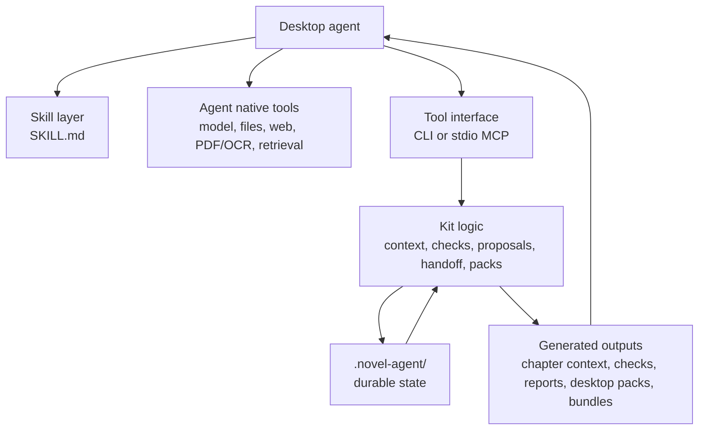
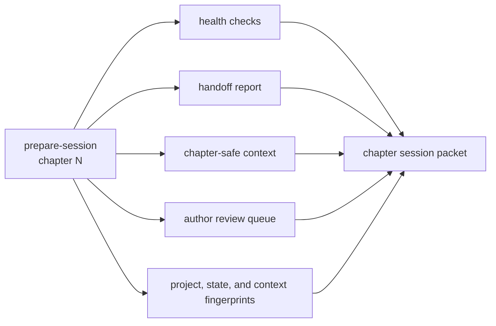
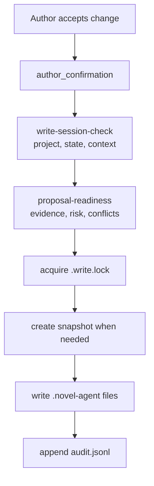

# Architecture

Long Novel Agent Kit is a local state and protocol layer for long-form fiction. It sits beside a desktop agent, not above it. The desktop agent keeps using its own model, file parsing, retrieval, web reading, and long-context abilities; the kit stores accepted continuity and exposes the operations needed to prepare, check, update, and hand off chapters.

## System Layers



### Layer 1: Host Desktop Agent

The host agent is responsible for:

- reading source material
- summarizing old drafts and notes
- using web or local research tools
- reasoning with long context
- drafting and revising prose
- presenting options to the author

The host agent is not treated as durable memory. Anything that must survive a new chat, a new agent, or a new computer should be written into `.novel-agent/`.

### Layer 2: Skill Instructions

`SKILL.md` is the workflow contract for agents. It tells the agent:

- to call `prepare-session` before drafting
- to call checks before presenting a chapter as ready
- to record accepted chapters only after author confirmation
- to use proposal review for post-write continuity changes
- to use handoff tools before another agent takes over

The skill file does not store data and does not execute anything. It is the behavioral guide.

### Layer 3: CLI And MCP

The same domain operations are exposed through two local interfaces:

- `cli.py`: shell commands for users, CLI-only agents, setup scripts, desktop packs, and no-Python bundles
- `server.py`: stdio MCP tools for desktop agents that can load local MCP servers

The MCP server is local stdio. It is not a cloud service and does not require a remote server.

### Layer 4: Durable State

`.novel-agent/` is the state center. It stores the accepted version of the project: chapters, facts, rules, sources, conflicts, proposals, agent activity, desktop verification evidence, audit rows, and snapshots.

### Layer 5: Generated Packs And Bundles

Generated files help humans and agents operate the kit:

- `desktop-pack` writes local HTML/JSON/schema/command packets.
- `proposal-review` writes review packets for proposed state changes.
- `desktop-handoff-bundle` writes a copyable `project/`, `pack/`, `runtime/`, launcher, and MCP snippet bundle.

These generated files are not the source of truth. `.novel-agent/` remains the durable state.

## State Model

| State file | Owner | Typical writer | Typical reader |
| --- | --- | --- | --- |
| `manifest.json` | Kit | `init`, migrations | every command |
| `rules.json` | Author / kit | setup, source intake, writer updates | context and checks |
| `chapters.jsonl` | Author-accepted text metadata | `record-chapter` | context, handoff, audits |
| `facts.jsonl` | Continuity facts | source intake, proposals, manual fact commands | checks and context |
| `sources.jsonl` | Source summaries | `source-intake`, `add-source` | context |
| `research.jsonl` | Research notes | `add-research`, source intake | context |
| `conflicts.jsonl` | Resolved contradictions | `resolve-conflict` | context and checks |
| `characters.json` | Character state | proposals and manual updates | context and checks |
| `debts.json` | Foreshadowing and plot debt | proposals and manual updates | context, delivery, handoff |
| `contracts.jsonl` | Chapter contracts | setup, proposals, manual contract updates | checks and delivery |
| `proposals.jsonl` | Proposed state changes | `propose-after-write` | review and apply gates |
| `agent_activity.jsonl` | Agent handoff activity | `record-agent-activity` | handoff readiness and integrity |
| `desktop_verifications.jsonl` | Real GUI client evidence | `record-desktop-check` | setup diagnostics and matrix |
| `audit.jsonl` | Write audit | every durable writer command | audit and recovery |
| `snapshots/` | Rollback state | snapshot and risky writer commands | restore |

## Read Path

The read path prepares the agent to write without mutating durable state.



The returned packet normally includes:

- project identity
- state fingerprint
- chapter context fingerprint
- visible chapter rules
- source summaries and research notes
- facts bounded by chapter visibility
- character, relationship, location, prop, and life-state constraints
- previous chapter tail and handoff notes
- open plot debt and foreshadowing
- author-review queue
- health checks and tool gates

The agent should write from this packet, not from memory of the chat.

## Check Path

The check path reads a draft and compares it against the durable state:

- required and forbidden phrases
- chapter contract required beats and forbidden moves
- future markers that should not appear yet
- structured fact conflicts
- relationship, location, prop ownership, life-state, and timeline conflicts
- missing required evidence or source-grounded requirements

Important commands:

- `check-chapter`
- `chapter-readiness`
- `diff-contract`
- `chapter-revision-prompt`
- `chapter-revision-compare`
- `chapter-delivery`

## Write Path

Durable writes are intentionally slower than reads.



Writer commands reject unsafe operations when:

- author confirmation is missing
- project identity does not match
- state fingerprint is stale
- chapter context fingerprint is stale
- proposal evidence is missing
- a proposal was rejected or already applied
- high-risk updates need author review
- another writer holds a non-stale lock

## Tool Surfaces

### CLI

Use CLI when:

- the agent cannot load MCP
- a human wants direct commands
- scripts need setup, validation, packaging, or no-Python runtime builds
- a generated desktop pack needs refresh or repair

### MCP

Use MCP when:

- the desktop agent can load local stdio MCP
- you want structured tool calls instead of shell commands
- the agent should work inside its normal GUI session

MCP supports mode and profile constraints:

- `--read-only`: exposes read tools and rejects writer tools
- writer mode: exposes writer tools but still requires author confirmation and write guards
- `--tool-profile core`: small writing path
- `--tool-profile writing`: common writing, setup, and handoff tools
- `--tool-profile full`: all available tools for advanced local workflows

## Desktop Pack Architecture

`desktop-pack` creates a local directory that can be read by humans and agents.

```text
pack/
  first-three.html
  local-summary.html
  user-steps.html
  pack-index.json
  commands.json
  commands-index.json
  chapter-session.json
  handoff-report.json
  project-status.json
  author-review-queue.json
  desktop-evidence-session.json
  acceptance-review.json
  writer-mode-approval.json
  schemas...
  scripts for macOS, Windows, and POSIX shells
```

The pack is a snapshot. The project may change after generation. Use:

- `pack-doctor` to check file integrity and command references
- `pack-freshness` to compare the pack with current `.novel-agent/`
- `chapter-session-freshness` to compare `chapter-session.json` with current state
- `rebind-pack-kit` when the pack points to an old local kit path

## No-Python Handoff Architecture

`desktop-handoff-bundle` is meant for another computer that already has a desktop agent but should not install Python.

```text
bundle/
  project/                  copied novel project snapshot
  pack/                     generated desktop pack
  runtime/                  standalone long-novel-agent and long-novel-agent-mcp
  START_HERE.*              launcher scripts
  agent-read-me-first.md    prompt and first instructions for the desktop agent
  mcp-configs/current/      refreshed local MCP snippets
  runtime-commands.*        commands using bundle-relative paths
  manifest.json
```

The target computer still uses local stdio MCP. No remote server is introduced.

## Boundaries

This kit does not:

- call an LLM
- perform embedding retrieval
- parse PDFs, OCR, web pages, or images by itself
- upload manuscripts
- replace author review
- guarantee literary quality

It does:

- preserve long-term continuity
- build chapter-safe context
- check drafts against durable facts and rules
- guard writer operations
- record audit trails
- support agent handoff
- generate local packs and no-Python handoff bundles
