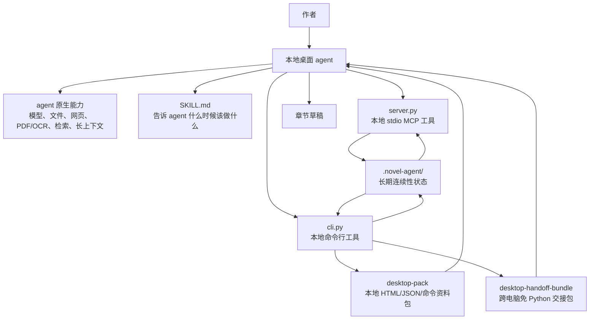
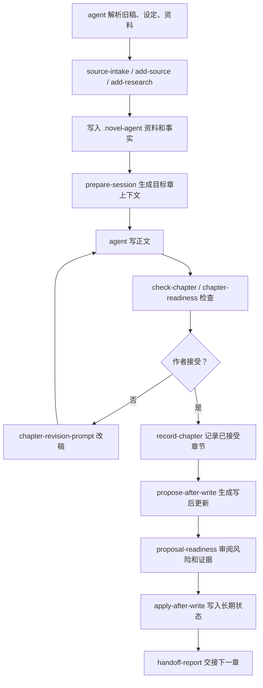

# 整体架构与功能说明

这份文档面向第一次接触 Long Novel Agent Kit 的作者、开发者和本地桌面 agent。目标是讲清楚三件事：

- 它到底在整个写作系统里处于什么位置。
- 它有哪些功能，每类功能解决什么问题。
- 桌面 agent 应该怎样使用它完成长篇小说接力写作。

## 一句话定位

Long Novel Agent Kit 是一个本地连续性工具层。桌面 agent 负责理解资料和写正文，Kit 负责把已经确认的长期事实保存下来，并在每次写作前后提供检查和交接。

它不是：

- 写作模型
- 稿件编辑器
- 云服务器
- PDF/OCR/网页解析器
- embedding 检索系统
- 稿匣主应用

它是：

- 本地 `.novel-agent/` 状态中心
- MCP 工具服务器
- CLI 工具集
- 桌面 agent 的 Skill 工作流
- 连续性检查器
- 章节上下文生成器
- 交接和审计系统
- 普通用户资料包生成器
- 免 Python 本地交接包生成器

## 总体架构



## 三层分工

### 1. 桌面 agent 层

桌面 agent 继续使用自己的能力：

- 阅读旧稿、设定、PDF、网页、图片和笔记
- 做联网考据
- 使用长上下文理解大量资料
- 起草正文
- 根据作者意见改稿
- 判断文学表达和节奏

这些能力不由 Kit 复制。Kit 不做模型推理，也不提供 RAG 系统。

### 2. 工具协议层

Kit 提供三种入口：

| 入口 | 适合谁 | 作用 |
| --- | --- | --- |
| `SKILL.md` | 支持 Skill 的 agent | 告诉 agent 必须遵守的长篇写作流程 |
| `server.py` MCP | 支持本地 stdio MCP 的桌面 agent | 让 agent 在 GUI 内直接调用结构化工具 |
| `cli.py` CLI | CLI-only agent、普通用户、脚本 | 初始化、检查、打包、交接、写入和验证 |

### 3. 长期状态层

`.novel-agent/` 是唯一长期状态中心。它保存：

- 已接受章节
- 资料摘要
- 考据笔记
- 冲突处理结果
- 人物状态
- 关系、地点、道具、生命状态、时间线事实
- 伏笔和剧情债务
- 章节合同
- 写后 proposal
- agent 接力活动
- 真实桌面客户端验证证据
- 写入审计和快照

聊天历史可以帮助当次写作，但不能作为长期状态来源。

## 典型写作流程



核心要求：

- 写前必须从 Kit 取上下文。
- 写后必须把已接受章节和状态变化写回 Kit。
- 不能让 agent 靠单次聊天窗口维护整部长篇。

## 功能模块

### 项目初始化和导入

用途：把一个小说项目变成可被本地 agent 接力的项目。

主要能力：

- `init`：创建新的 `.novel-agent/`
- `quickstart`：自动初始化或导入已有项目
- `import-gaoxia`：导入稿匣风格项目
- `import-audit`：检查导入状态是否还匹配原项目
- `export-state` / `import-state`：迁移 `.novel-agent/` 状态

结果：agent 不再只看到散落文件，而是看到结构化长期状态。

### 证据融合

用途：让桌面 agent 自己解析资料，再把确认后的结果交给 Kit 保存。

主要能力：

- `source-intake`
- `add-source`
- `add-research`
- `resolve-conflict`
- `add-fact`
- `validate_source_intake`

解决的问题：

- PDF、网页、旧稿摘要用完就丢
- 不同资料互相矛盾
- 资料适用章节不清楚
- agent 写早期章节时提前知道后段设定

### 章节上下文

用途：开写某章前，生成本章该看到的内容。

主要能力：

- `prepare-session`
- `build-context`
- `context-brief`
- `pack-freshness`
- `chapter-session-freshness`

返回内容包括：

- 项目身份
- 状态 hash
- 章节上下文 hash
- 当前章可见资料
- 已接受章节尾段
- 人物、地点、道具、关系、生命状态事实
- 章节合同
- 伏笔和剧情债务
- 作者审阅队列
- 交接报告

这部分是长篇连续性的核心。

### 草稿检查和修订

用途：正文写完后，检查它有没有破坏长期状态。

主要能力：

- `check-chapter`
- `chapter-readiness`
- `diff-contract`
- `chapter-revision-prompt`
- `chapter-revision-compare`

可检查：

- 必写项缺失
- 禁写项出现
- 提前泄露未来设定
- 人物死亡、生还、关系、位置、道具归属冲突
- 时间线顺序冲突
- 章节合同不满足

### 交稿和作者接受

用途：把草稿交给作者，并把作者接受后的写入步骤拆清楚。

主要能力：

- `chapter-delivery`
- `chapter-range-delivery`
- `chapter-acceptance-plan`
- `chapter-range-acceptance-plan`
- `acceptance-review-from-pack`

它不会自动宣布草稿可用，而是把问题、风险、写入边界和后续命令列出来。

### 写后更新和 proposal

用途：作者接受章节后，把正文里发生的新事实写入长期状态。

主要能力：

- `record-chapter`
- `proposal-template`
- `propose-after-write`
- `proposal-review`
- `proposal-readiness`
- `apply-after-write`
- `reject-proposal`

设计原因：agent 写完一章后可能会提出人物状态、伏笔、事实更新，但这些更新不应静默进入长期状态，必须经过证据、风险和作者确认。

### 接力和交接

用途：让下一位 agent 能安全接手。

主要能力：

- `record-agent-activity`
- `list-agent-activity`
- `agent-activity-report`
- `handoff-report`
- `handoff-readiness`
- `handoff-integrity`
- `handoff-range-report`

它解决的是“换一个 agent 后不知道前一个 agent 做了什么”的问题。

### 桌面客户端接入和验证

用途：区分“本地命令能跑”和“真实 GUI 桌面客户端能调用 MCP”。

主要能力：

- `desktop-setup`
- `desktop-verify`
- `doctor --start-mcp-test`
- `desktop-checklist`
- `ingest-desktop-evidence`
- `desktop-results-doctor`
- `record-desktop-check`
- `desktop-matrix`

本地配置检查不能替代真实 GUI 客户端证据，所以 Kit 单独保存验证记录。

### 普通用户资料包

用途：把复杂命令和状态整理成一个本地目录，让普通用户和 agent 都能打开。

主要能力：

- `desktop-pack`
- `pack-doctor`
- `pack-schema-check`
- `desktop-pack-readiness`
- `agent-takeover-from-pack`
- `agent-startup-prompt-from-pack`
- `author-actions`
- `troubleshooting-from-pack`

资料包包含：

- 给用户看的 HTML
- 给 agent 看的 JSON
- 本地 schema
- 命令清单
- 章节会话
- 交接报告
- 作者审阅材料
- 真实客户端取证材料
- 安装、升级、卸载、检查、归档脚本

### 免 Python 交接

用途：把项目交给另一台普通电脑使用，目标电脑不需要安装 Python。

主要能力：

- `standalone-build`
- `desktop-handoff-bundle`

产物结构：

```text
bundle/
  project/
  pack/
  runtime/
  START_HERE.*
  agent-read-me-first.md
  mcp-configs/current/
  runtime-commands.*
  manifest.json
```

注意：运行时必须在目标系统相同平台构建，例如 Windows runtime 要在 Windows 上构建。

## 写入安全设计

长期状态写入有几道保护：

- 默认 MCP 是 read-only。
- writer 操作要求作者确认。
- `write-session-check` 检查项目 ID、状态 hash、章节上下文 hash。
- proposal readiness 检查证据、冲突和高风险更新。
- `.write.lock` 防止并发写入。
- 应用 proposal 前创建快照。
- 写入都会追加 `audit.jsonl`。

这套机制不能保证 agent 一定写得好，但可以减少它悄悄污染长期状态。

## 常见使用方式

### 开发者从源码使用

```bash
git clone https://github.com/mushroomfk/long-novel-agent-kit.git
cd long-novel-agent-kit
python cli.py doctor
python cli.py init ./my-novel --title "我的长篇小说"
python cli.py prepare-session ./my-novel --chapter 1 --platform codex --mode read-only --format markdown
```

### 桌面 agent 使用 MCP

```bash
python server.py --read-only --tool-profile core
```

然后把 MCP 配置片段加入 Codex、Cursor、Claude Desktop 或通用 JSON MCP 客户端。

### 给普通用户打包

```bash
python cli.py desktop-pack ./my-novel --platform codex --mode read-only --chapter 1 --output-dir ./my-novel-pack --format markdown
```

### 给无 Python 电脑打包

```bash
python cli.py standalone-build --output-dir release/runtime --target-os macos --apply --force --format json
release/runtime/long-novel-agent desktop-handoff-bundle ./my-novel --runtime-dir release/runtime --output-dir release/bundle --archive --force --format json
```

## 最重要的边界

- 它不替你写小说。
- 它不替你判断文学质量。
- 它不替你解析所有资料。
- 它不替你做云同步。
- 它不替你信任任何 agent 的临时聊天历史。

它只做一件事：把长篇小说需要长期保存、可检查、可交接的连续性状态变成本地工具协议。
